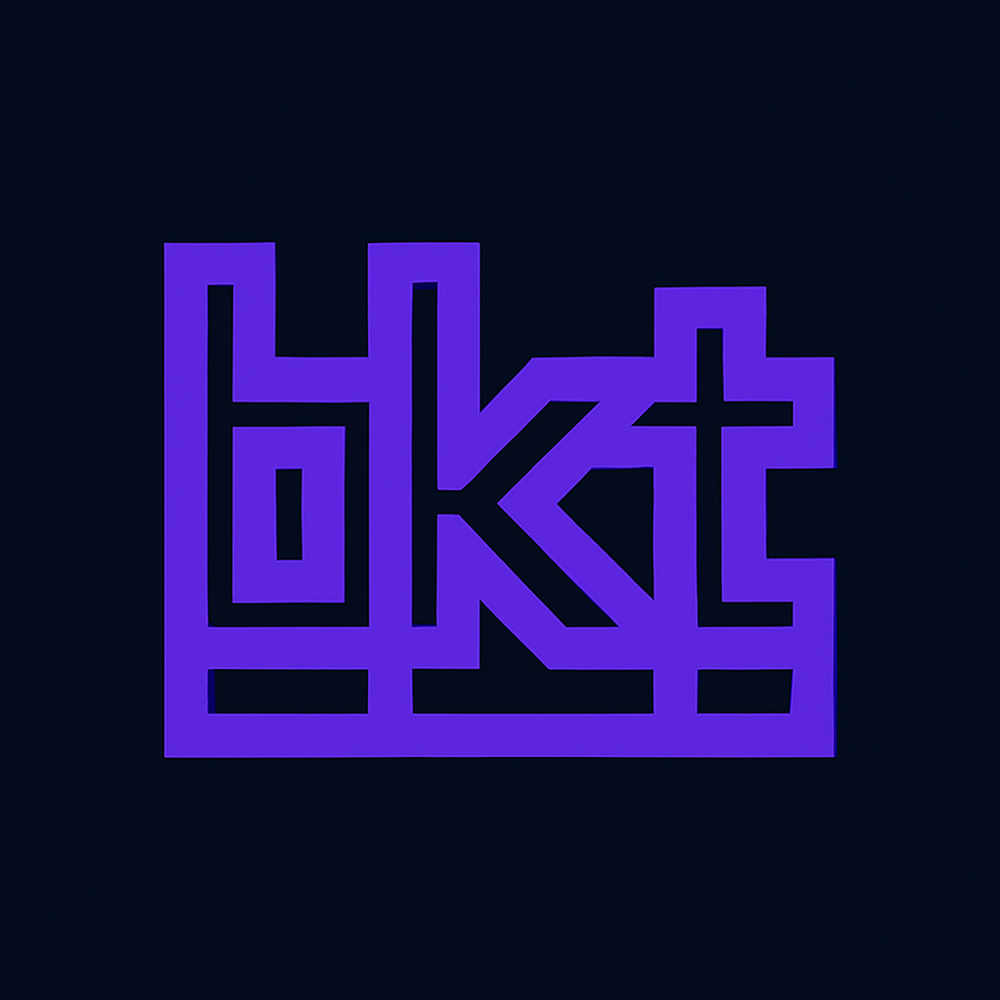

<div align="center">
  
  <h1>bkt</h1>
  <p>A self-hosted S3-compatible object storage gateway with multi-backend support, policy-based access control, and a modern web interface.</p>
  <p><a href="https://bkt.tips">https://bkt.tips</a></p>
</div>

## Overview

bkt is a unified object storage system that provides a single interface to manage files across multiple storage backends (local filesystem, AWS S3, MinIO, DigitalOcean Spaces, etc.). It includes user authentication, fine-grained access policies, and an S3-compatible API that enables filesystem mounting with tools like s3fs-fuse.

## Quick start

The fastest way to run bkt is the single-container **omnibus** image. It bundles the API, the web UI, and PostgreSQL, and boots with zero configuration — local storage, self-signed TLS, and an auto-generated admin password printed to the logs:

```bash
docker run -d --name bkt \
  -p 9443:9443 \
  -p 9000:9000 \
  -v bkt-data:/data \
  ghcr.io/seahop/bkt
```

- **`9443`** — web console + REST API → open **https://localhost:9443** (accept the self-signed cert)
- **`9000`** — S3-compatible API for `aws` / `s3fs`

Then:

- Get the first-boot admin password: `docker logs bkt | grep -A2 "admin credentials"` — or set your own with `-e ADMIN_PASSWORD=...`.
- Create an access key in the UI (Settings) and point S3 tools at `https://localhost:9000`.

All state (database, objects, certs, secrets) lives in the `bkt-data` volume, so the container itself is disposable. For multi-node / external-Postgres deployments, use the Helm chart in [`charts/bkt`](charts/bkt) or [docker-compose.prod.yml](docker-compose.prod.yml).

### Configuration

Everything is configured with **environment variables passed at run time** (`docker run -e …`) — never at build time, and you never need a `.env` file for the single container. Anything you omit gets a safe default; secrets are auto-generated on first boot and persisted to the volume. Common ones:

```bash
docker run -d -p 9443:9443 -p 9000:9000 -v bkt-data:/data \
  -e ADMIN_PASSWORD='choose-a-strong-password' \
  -e CORS_ALLOWED_ORIGINS='https://bkt.example.com' \
  -e TLS_ENABLED=false \                 # serve HTTP behind your own proxy
  -e S3_ENABLED=true \
  -e S3_ACCESS_KEY_ID='AKIA...' -e S3_SECRET_ACCESS_KEY='...' \
  -e S3_BUCKETS='my-existing-bucket' \   # auto-provision a bucket on startup
  ghcr.io/seahop/bkt
```

`ADMIN_PASSWORD`, `JWT_SECRET`, and `ENCRYPTION_KEY` are read on **first boot** and then stored in the volume (stored values win on later boots). See the full list in **[docs/deployment/configuration.md](docs/deployment/configuration.md)** and the annotated [.env.example](.env.example).

### Deployment options

The same codebase ships three ways. Full details in **[docs/deployment/deployment-options.md](docs/deployment/deployment-options.md)**.

| | Command | Containers | For |
|---|---|---|---|
| **Omnibus** (`docker pull`) | `docker run … ghcr.io/seahop/bkt` | 1 (backend+UI+DB) | single-node self-hosting |
| **Clone + compose** | `git clone …` → `docker compose up` | 3 (db, backend, frontend) | developing on the code (hot-reload) |
| **compose.prod / Helm** | pulls `bkt-backend` + Postgres | 2 (backend, external DB) | scale-out / HA |

All three run the same Go binary with the embedded UI — they are different *packagings* of one codebase (built from the same root `Dockerfile`).

## Features

### Storage
- **Multi-backend support** - Store objects on local disk or any S3-compatible service
- **Per-bucket backend selection** - Choose storage location when creating each bucket
- **Virtual folder hierarchy** - Organize objects with folder-like paths
- **Large file support** - Async uploads with progress tracking for large files

### Security
- **JWT authentication** - Secure token-based auth with refresh tokens
- **Policy-based access control** - IAM-style policies for fine-grained permissions
- **Access keys** - S3-compatible credentials for API and filesystem access
- **TLS everywhere** - HTTPS for all services with auto-generated certificates

### Web Interface
- **Dual-pane file browser** - Split view for easier file organization
- **Drag-and-drop** - Move files between folders and panes
- **Search and filters** - Find files by name, extension, size, date, or folder depth
- **Context menus** - Right-click for quick actions
- **Dark mode** - Modern dark theme throughout

### S3 Compatibility
- **S3 REST API** - Works with AWS SDKs and S3 tools
- **Filesystem mounting** - Mount buckets as local drives with s3fs-fuse
- **AWS Signature V4** - Standard S3 authentication

## Tech Stack

- **Backend**: Go with Gin framework
- **Frontend**: React with TypeScript and Tailwind CSS
- **Database**: PostgreSQL
- **Deployment**: Docker and Docker Compose

## Quick Start

### Prerequisites

- Docker and Docker Compose
- Python 3 (for setup script)

### Installation

1. Clone or navigate to the repository:
```bash
cd bkt
```

2. Run the setup script to generate credentials and SSL certificates:
```bash
python3 setup.py
```

This generates:
- Admin credentials in `.env`
- Database password in `.env`
- JWT secret in `.env`
- SSL/TLS certificates in `certs/`

**Save the admin credentials displayed by the setup script.**

3. Start all services:
```bash
docker compose up --build
```

4. Access the application:
   - Web UI: https://localhost:5173
   - API: https://localhost:9443
   - Database: localhost:5432

The application uses self-signed certificates. Accept browser warnings or trust the CA certificate (see `certs/README.md`).

### Stop Services

```bash
docker compose down
```

### Reset Everything

```bash
docker compose down -v
rm -rf data/
```

## S3 Filesystem Mounting

Mount buckets as local filesystems using s3fs-fuse:

```bash
# Create credentials file (get keys from web UI Settings page)
echo "YOUR_ACCESS_KEY:YOUR_SECRET_KEY" > ~/.bkt
chmod 600 ~/.bkt

# Mount a bucket
s3fs my-bucket ~/mnt/my-bucket \
  -o url=https://localhost:9443 \
  -o use_path_request_style \
  -o passwd_file=~/.bkt \
  -o no_check_certificate

# Unmount
fusermount -u ~/mnt/my-bucket
```

See [docs/guides/MOUNTING.md](docs/guides/MOUNTING.md) for detailed instructions.

## Project Structure

```
bkt/
├── backend/                 # Go backend API
│   ├── cmd/                 # Application entry point
│   ├── internal/            # Core application code
│   │   ├── api/             # HTTP handlers
│   │   ├── auth/            # Authentication (JWT, OAuth, Vault)
│   │   ├── middleware/      # Request middleware
│   │   ├── models/          # Database models
│   │   └── storage/         # Storage backends (local, S3)
│   └── db/                  # Database migrations
├── frontend/                # React frontend
│   └── src/
│       ├── components/      # Reusable UI components
│       ├── pages/           # Page components
│       ├── services/        # API client
│       └── store/           # State management
├── docs/                    # Documentation
│   ├── api/                 # API reference
│   ├── guides/              # User guides
│   ├── security/            # Security documentation
│   ├── deployment/          # Deployment guides
│   └── examples/            # Code examples
├── certs/                   # SSL certificates (generated)
├── data/                    # Persistent data (generated)
│   ├── postgres/            # Database files
│   └── buckets/             # Local object storage
├── docker/                  # Docker scripts
├── setup.py                 # Setup and certificate generator
└── docker-compose.yml       # Container orchestration
```

## Development

### Backend

The backend uses Air for hot reload:

```bash
docker compose logs -f backend
```

### Frontend

The frontend uses Vite with HMR:

```bash
docker compose logs -f frontend
```

### Database

```bash
docker exec -it bkt-db psql -U objectstore -d objectstore
```

## API Examples

```bash
# Login
curl -k -X POST https://localhost:9443/api/auth/login \
  -H "Content-Type: application/json" \
  -d '{"username":"admin","password":"YOUR_PASSWORD"}'

# Save token
export TOKEN="your_jwt_token"

# Create bucket
curl -k -X POST https://localhost:9443/api/buckets \
  -H "Authorization: Bearer $TOKEN" \
  -H "Content-Type: application/json" \
  -d '{"name":"my-bucket","storage_backend":"local"}'

# Upload file
curl -k -X POST https://localhost:9443/api/buckets/my-bucket/objects \
  -H "Authorization: Bearer $TOKEN" \
  -F "file=@myfile.txt" \
  -F "key=myfile.txt"

# List objects
curl -k -X GET https://localhost:9443/api/buckets/my-bucket/objects \
  -H "Authorization: Bearer $TOKEN"
```

Use `-k` to accept self-signed certificates in development.

## Documentation

- [Getting Started](docs/guides/getting-started.md)
- [Full API Reference](docs/api/API.md)
- [S3fs Mounting Guide](docs/guides/MOUNTING.md)
- [Security Overview](docs/security/security-overview.md)
- [Production Checklist](docs/deployment/production-checklist.md)
- [Documentation Index](docs/DOCUMENTATION_INDEX.md)

## License

Apache-2.0
